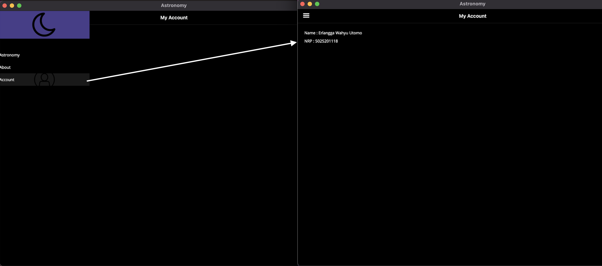
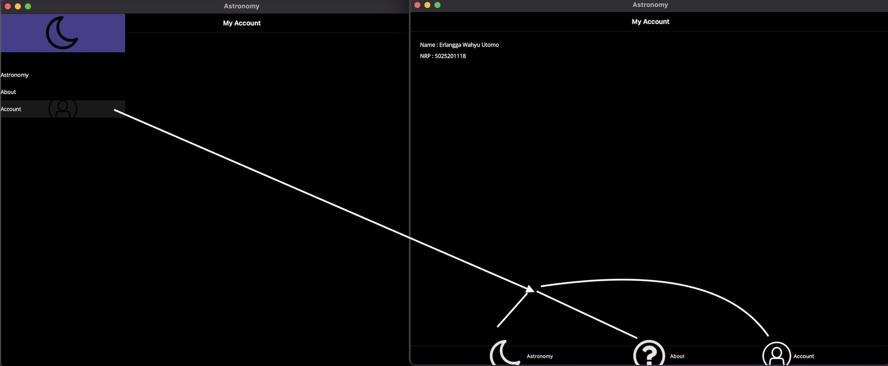
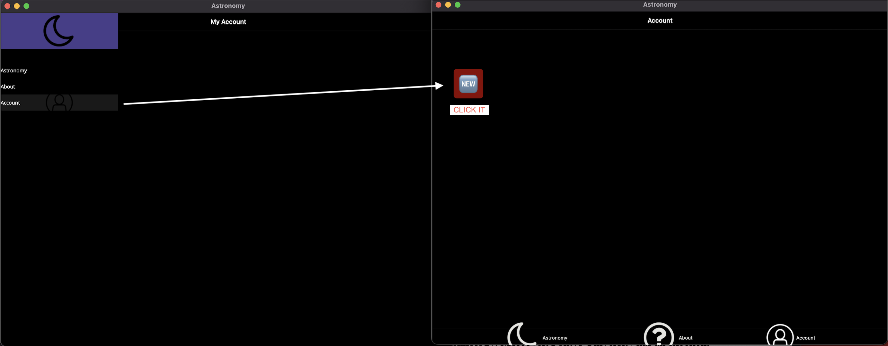
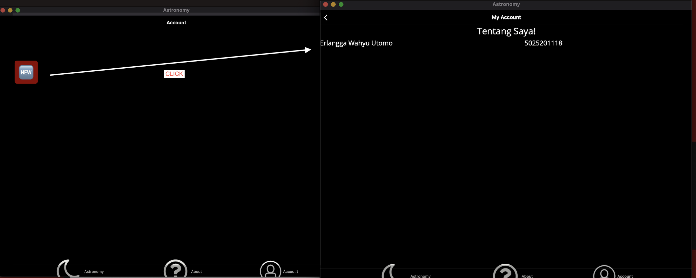

# Framework Programming Assignment 1

Assignment 1 Framework Programming (IUP)  
By Erlangga Wahyu Utomo (5025201118)

## Exercise 3

### Add name and student number to a new layout.

## Exercise 5

### Implement tab navigation

## Exercise 7

### Use tabbed pages with navigation pages

